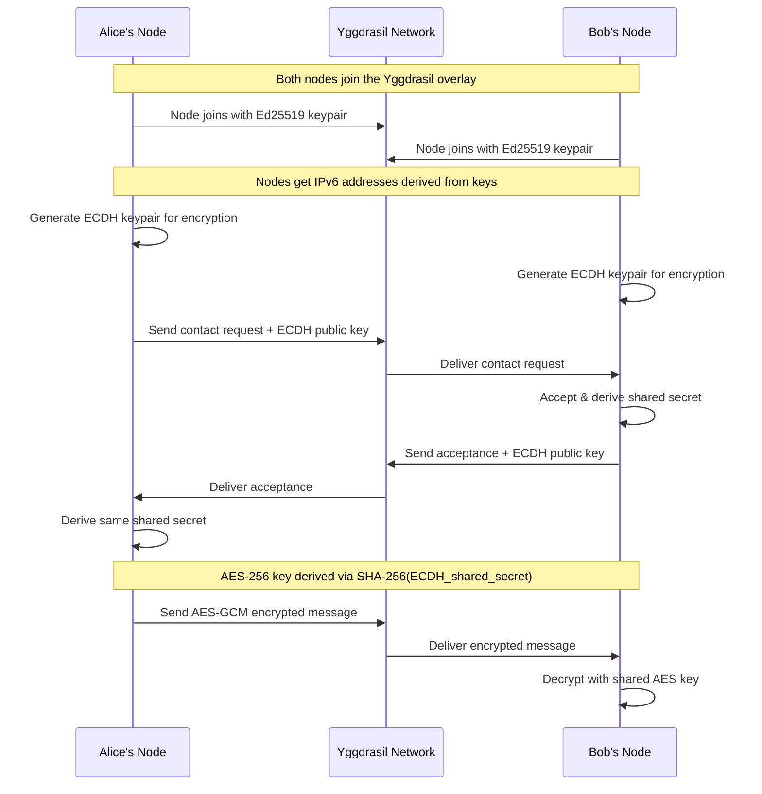
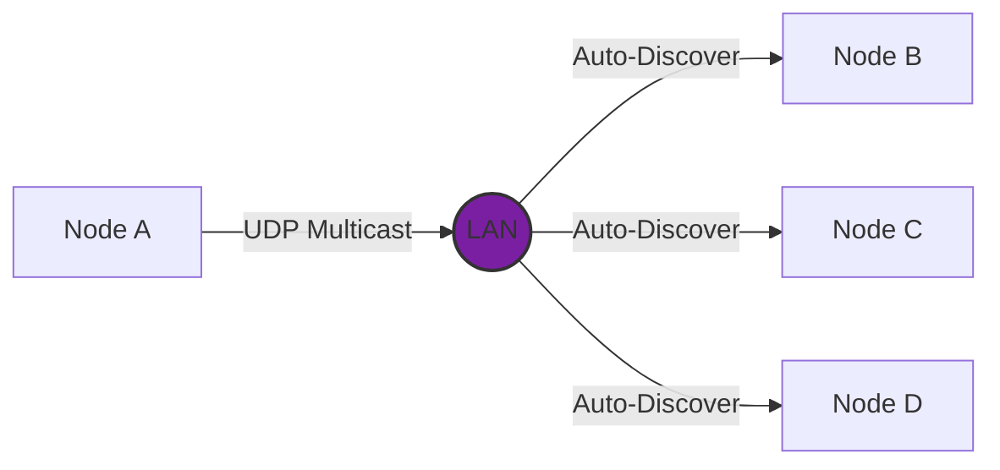
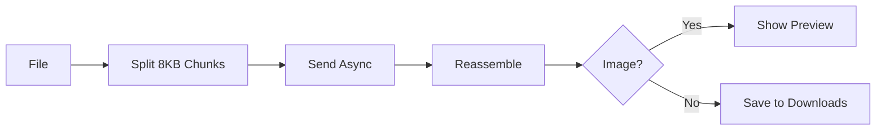
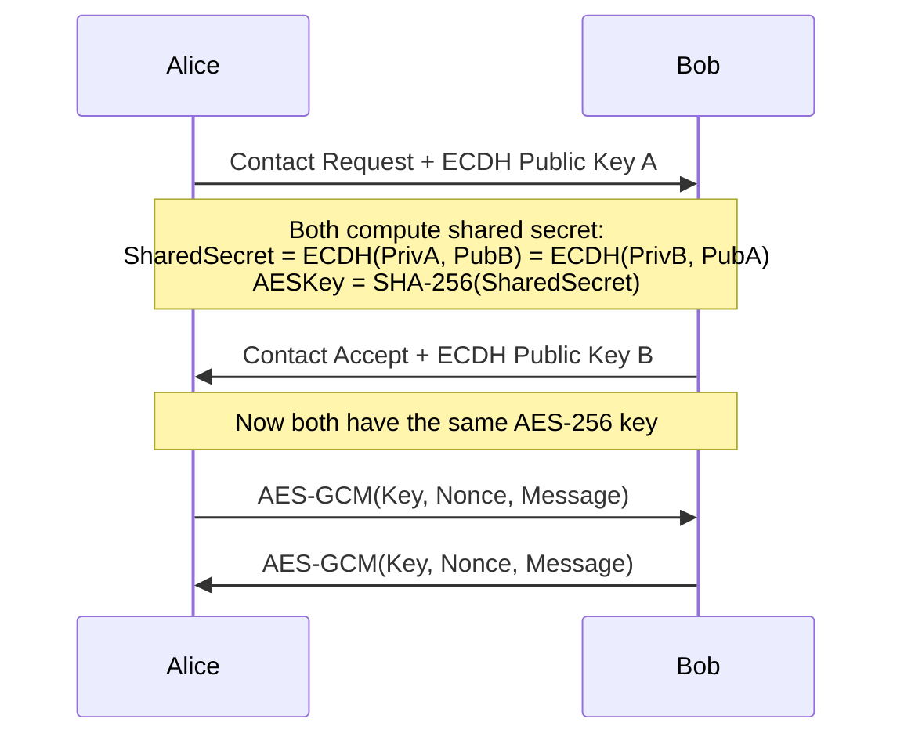
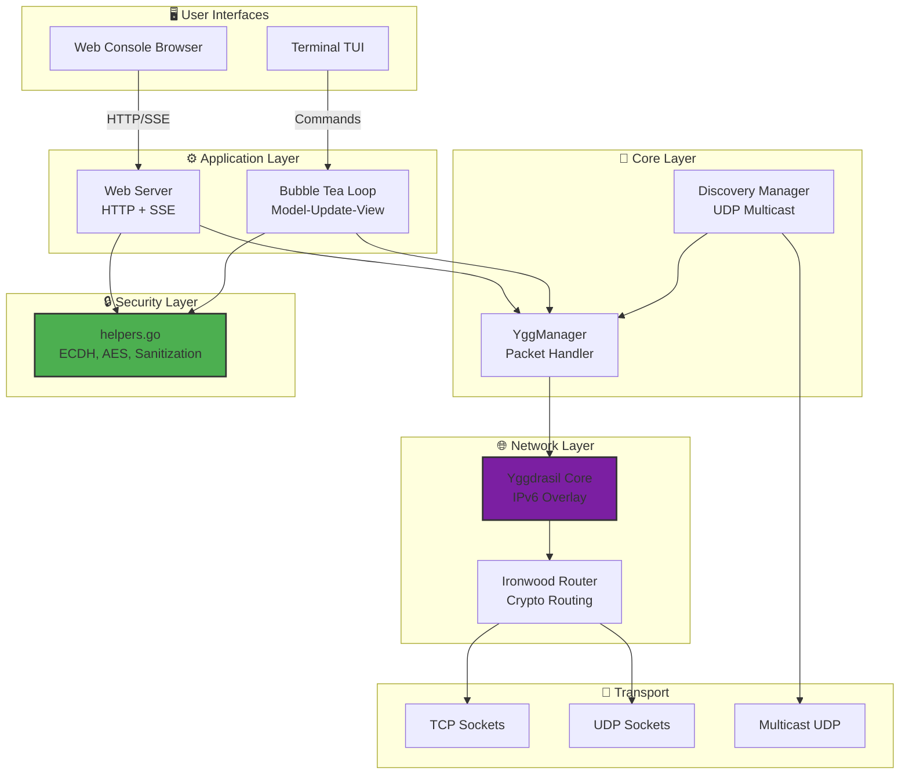
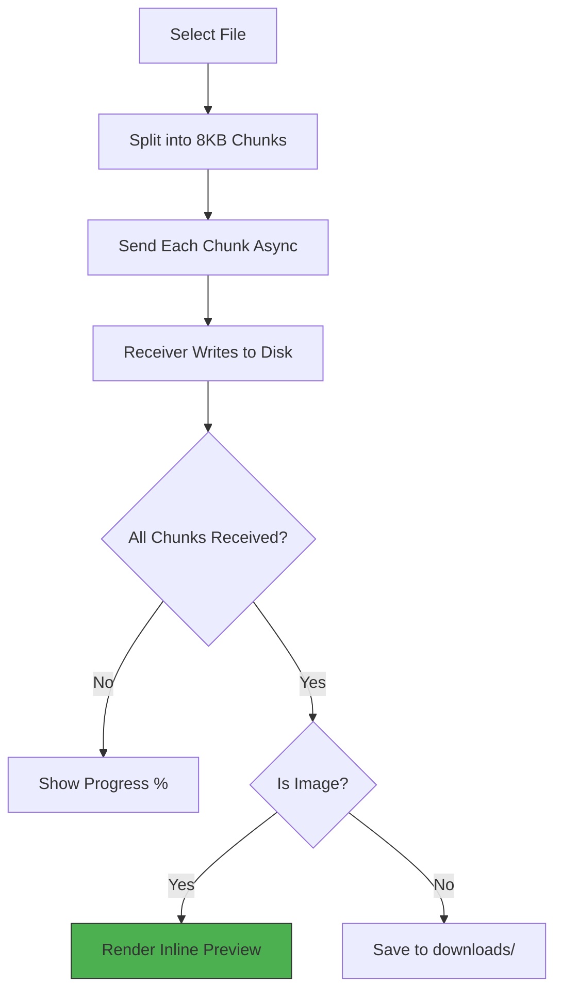
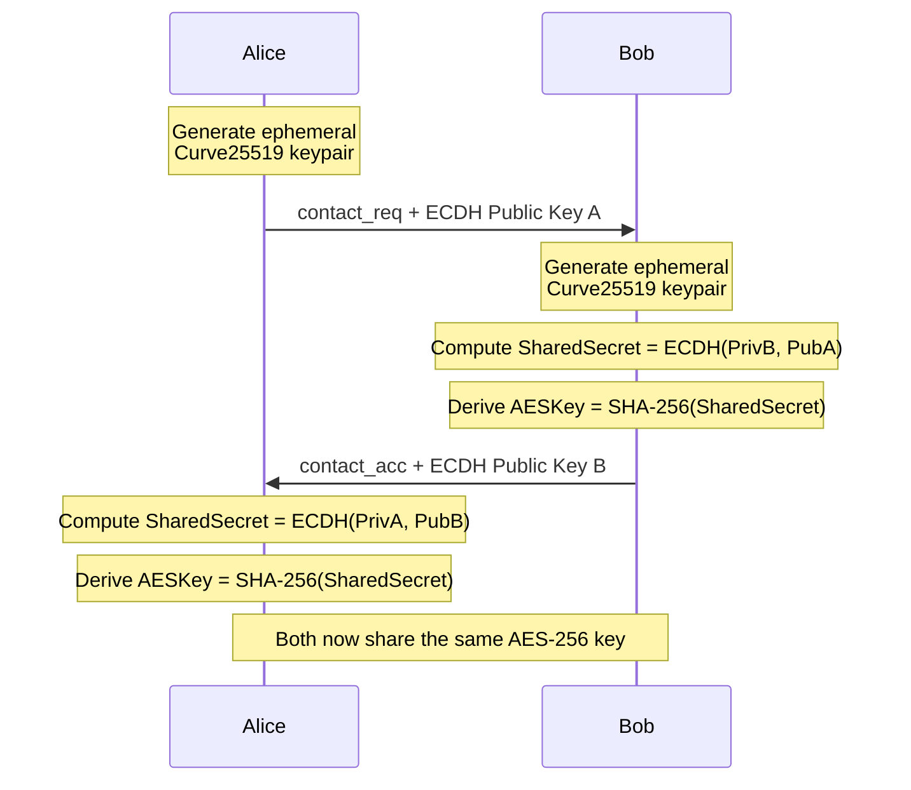
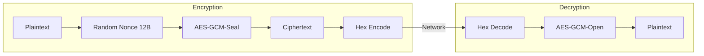
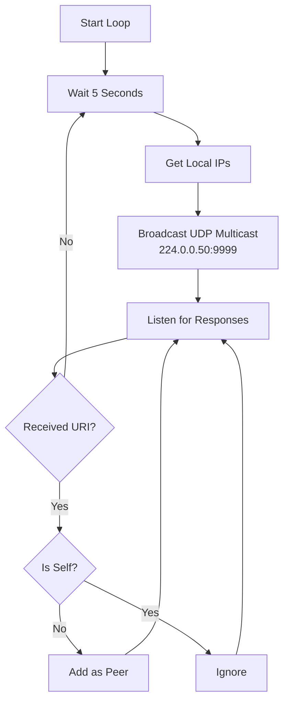

<div align="center">


# ⚡ YGGDRASIL MESH CHAT ⚡

### A Zero-Dependency, Serverless, Decentralized P2P Encrypted Messaging & File Exchange Client

[](https://golang.org)
[](#-encryption-deep-dive)
[](https://yggdrasil-network.github.io/)
[](#-dual-interface-mode)
[](#-testing)
[](#-license)

---

**[Features](#-key-features)** •
**[Quick Start](#-quick-start)** •
**[Documentation](#-table-of-contents)** •
**[Download](#-installation--building)** •
**[Contributing](#-contributing)**

</div>

---

## 📖 Table of Contents

<details>
<summary>Click to expand table of contents</summary>

- [Overview](#-overview)
  - [What is Yggdrasil Mesh Chat?](#what-is-yggdrasil-mesh-chat)
  - [What is Yggdrasil?](#what-is-yggdrasil)
  - [How Does It Work?](#how-does-it-work)
  - [Why Was This Built?](#why-was-this-built)
- [Key Features](#-key-features)
  - [End-to-End Encryption](#-end-to-end-encryption-e2ee)
  - [Automatic Network Discovery](#-automatic-network-discovery)
  - [Dual Interface Mode](#-dual-interface-mode)
  - [File Transfers](#-asynchronous-p2p-file-transfers)
  - [Real-Time Features](#-real-time-messaging-features)
- [Security Architecture](#-security-architecture)
- [System Architecture](#-system-architecture)
- [Installation & Building](#-installation--building)
- [Quick Start](#-quick-start)
- [Usage Guide](#-usage-guide)
- [Web Console](#-web-console)
- [Terminal TUI](#-terminal-tui)
- [Slash Commands](#-slash-commands-reference)
- [Configuration](#-configuration)
- [File Transfers](#-file-transfers)
- [Encryption Deep Dive](#-encryption-deep-dive)
- [Network Discovery](#-network-discovery)
- [Testing](#-testing)
- [Troubleshooting](#-troubleshooting)
- [Use Cases](#-practical-use-cases)
- [Deployment](#-deployment)
- [Dependencies](#-dependencies)
- [Contributing](#-contributing)
- [License](#-license)

</details>

---

## 📖 Overview

<div align="center">

> **"No servers. No accounts. No dependencies. Just encrypted peer-to-peer chat."**

</div>

### What is Yggdrasil Mesh Chat?

**Yggdrasil Mesh Chat** is a next-generation, serverless, peer-to-peer encrypted messaging and file exchange client that operates entirely in user-space on top of the [Yggdrasil IPv6 Overlay Network](https://yggdrasil-network.github.io/).

Unlike traditional messaging applications that rely on centralized servers, cloud infrastructure, and third-party services, Yggdrasil Mesh Chat enables direct, encrypted communication between nodes with:

<div align="center">

| ❌ What You Don't Need | ✅ What You Get |
|:----------------------:|:---------------:|
| External servers | True peer-to-peer |
| User accounts | Cryptographic identity |
| Internet connection | Works on LAN |
| Phone numbers | Privacy by default |
| Cloud storage | Local data only |
| Trust in companies | Trust in math |

</div>

### What is Yggdrasil?

[Yggdrasil](https://yggdrasil-network.github.io/) is an early-stage implementation of a fully encrypted, self-arranging IPv6 overlay network. It creates a decentralized mesh network where:

```
┌─────────────────────────────────────────────────────────────────┐
│  🌐 Every node gets a unique IPv6 address                       │
│     └── Derived cryptographically from your public key          │
│                                                                 │
│  🔀 Routing is automatic                                        │
│     └── Nodes discover each other and build optimal paths       │
│                                                                 │
│  🔒 All traffic is encrypted                                    │
│     └── Using the Noise Protocol Framework                      │
│                                                                 │
│  🏛️ No central authority                                        │
│     └── No DNS, no certificate authorities, no registrars       │
│                                                                 │
│  🌍 Works anywhere                                              │
│     └── Over LAN, WAN, internet, or any TCP/UDP connection      │
└─────────────────────────────────────────────────────────────────┘
```

The name "Yggdrasil" comes from Norse mythology — the immense cosmic tree that connects the nine worlds. Similarly, the Yggdrasil network connects nodes across the world in a tree-like routing structure.

### How Does It Work?



### Why Was This Built?

<details>
<summary><strong>Click to see the problems with traditional messaging apps</strong></summary>

Traditional messaging applications (Signal, WhatsApp, Telegram, Discord) all share common problems:

| Problem | Description |
|:--------|:------------|
| 🏢 **Centralized Infrastructure** | Servers can go down, be hacked, or be compelled to hand over data |
| 📱 **Account Requirements** | Phone numbers, email addresses, or other PII is required |
| 📊 **Metadata Collection** | Even with E2EE, servers know who talks to whom, when, and how often |
| 🌐 **Internet Dependency** | They require internet connectivity to function |
| 💥 **Single Points of Failure** | If the company shuts down, the service disappears |
| 🤝 **Trust Requirements** | You must trust the company to not backdoor the encryption |

</details>

**Yggdrasil Mesh Chat solves ALL of these problems:**

<div align="center">

| Feature | Status |
|:--------|:------:|
| Truly Decentralized | ✅ |
| Identity-Free | ✅ |
| Metadata-Free | ✅ |
| Network-Agnostic | ✅ |
| Resilient | ✅ |
| Trustless | ✅ |

</div>

---

## 🚀 Key Features

<div align="center">

### 🔒 End-to-End Encryption (E2EE)

</div>

All messages between contacts are encrypted using industry-standard cryptography:

| Component | Technology | Used By |
|:----------|:-----------|:--------|
| **Key Exchange** | Curve25519 Diffie-Hellman (ECDH) | Signal, WhatsApp, WireGuard |
| **Message Encryption** | AES-256-GCM | TLS 1.3, IPsec |
| **Key Derivation** | SHA-256 | Bitcoin, TLS |
| **Identity Keys** | Ed25519 | SSH, Tor |

**Visual Indicators:**
- 🔒 = End-to-end encrypted
- 🔓 = Unencrypted (pending key exchange)

---

<div align="center">

### 🌐 Automatic Network Discovery

</div>



- **UDP Multicast Beaconing** on `224.0.0.50:9999` every 5 seconds
- **Zero Configuration** — nodes find each other automatically
- **Self-Detection** — prevents connecting to yourself
- **Manual Peering** — add remote peers via TCP URI

---

<div align="center">

### 🌍 Dual Interface Mode

</div>

<div align="center">

| Web Console (Default) | Terminal TUI (Alternative) |
|:---------------------:|:-------------------------:|
| Glassmorphic UI | 5 built-in themes |
| Real-time SSE updates | Keyboard-driven |
| Audio notifications | Split-pane layout |
| Screen shake effects | Image previews |
| Command autocomplete | Typing indicators |
| Responsive design | Read receipts |

</div>

---

<div align="center">

### 📥 Asynchronous P2P File Transfers

</div>



- **Chunked Transfer** — 8KB chunks for reliable delivery
- **Progress Tracking** — real-time percentage display
- **Image Previews** — PNG/JPG rendered inline
- **Safe Filenames** — path traversal protection

---

<div align="center">

### 💬 Real-Time Messaging Features

</div>

| Feature | Description |
|:--------|:------------|
| ✅✓ **Read Receipts** | Single check when sent, double check when read |
| ⌨️ **Typing Indicators** | See when your contact is typing |
| ⚡ **Nudge/Shake** | Send attention-grabbing screen vibrations |
| 💾 **Offline Queueing** | Messages buffered when contact is offline |
| 🔄 **Auto-Flush** | Queued messages sent when contact comes online |
| 🔍 **Message Search** | Full-text search through chat history |
| ↩️ **Message Replies** | Reply to specific messages |
| 😊 **Message Reactions** | React with 👍❤️😂😮😢🔥👏🎉 |
| ✏️ **Message Editing** | Edit sent messages |
| 🗑️ **Message Deletion** | Delete messages with confirmation |
| 📝 **Markdown Support** | **Bold**, *italic*, `code`, ~~strikethrough~~, [links]() |
| 😊 **Emoji Picker** | Built-in emoji selector |
| 📢 **Broadcast Lists** | Send message to all contacts at once |

---

<div align="center">

### 🔒 Security Features

</div>

| Feature | Description |
|:--------|:------------|
| 🚫 **Contact Blocking** | Block/unblock contacts |
| 💥 **Panic Button** | Emergency data wipe with triple confirmation |
| ⏰ **Auto-Delete** | Configurable message expiry (days) |
| 🔐 **E2EE Indicators** | Visual 🔒/🔓 for encryption status |

---

<div align="center">

### 🎨 UI/UX Features

</div>

| Feature | Description |
|:--------|:------------|
| 🔔 **Desktop Notifications** | Browser notifications for new messages |
| 📁 **Drag & Drop** | Drop files to send directly |
| 🎨 **Custom Themes** | User-defined color schemes |
| 🔍 **Search & Highlight** | Search messages with highlighting |
| ⏱️ **Typing Toggle** | Enable/disable typing indicators |
| ✓✓ **Receipt Toggle** | Enable/disable read receipts |
| 📊 **Peer Statistics** | Connection quality metrics |
| 📈 **Bandwidth Monitor** | Track data usage |
| 🌐 **Connection Graph** | Visual mesh network map |
| 🔄 **Auto-Reconnect** | Automatic reconnection with backoff |

---

## 🛡️ Security Architecture

<details>
<summary><strong>Click to expand security details</strong></summary>

### Threat Model

| Threat | Protection |
|:-------|:-----------|
| 🔍 **Eavesdropping** | E2EE with AES-256-GCM |
| 🕵️ **Man-in-the-Middle** | Curve25519 key exchange |
| ✍️ **Message Forgery** | GCM authentication tags |
| 🔄 **Replay Attacks** | Timestamp-based nonce |
| 📁 **Path Traversal** | Filename sanitization |
| 💉 **XSS Attacks** | HTML escaping |
| 🌊 **Flooding/Spam** | Rate limiting (5/min) |
| 💾 **Data Corruption** | Atomic file writes |
| ⚡ **Race Conditions** | Mutex protection |

### Cryptographic Details



### Security Best Practices

> ⚠️ **Important:** Always verify contact keys through a separate channel!

1. **Verify Contact Keys** — Use Signal, in-person, or another trusted channel
2. **Use Strong Usernames** — Choose unique names to avoid impersonation
3. **Keep Software Updated** — Pull latest changes for security patches
4. **Firewall Configuration** — Block unnecessary ports on your overlay IPv6
5. **Separate Configs** — Use different config files for different identities

</details>

---

## 🏗️ System Architecture



### File Structure

```
yggchat/
├── 📄 main.go                 # Entry point & CLI flags
├── 📄 config.go               # Configuration management
├── 📄 ygg.go                  # Yggdrasil network manager
├── 📄 ygg_test.go             # Core tests
├── 📄 discovery.go            # UDP multicast discovery
├── 📄 helpers.go              # Security & utilities
├── 📄 helpers_test.go         # Helper tests
├── 📄 web_server.go           # HTTP/SSE server
├── 📄 tui.go                  # Terminal UI
├── 📄 ui_styles.go            # Theme definitions
├── 📄 image_render.go         # Image preview renderer
├── 📁 assets/                 # Static assets
│   └── 🖼️ logo files
├── 📁 scripts/                # Utility scripts
│   └── 📄 generate_logo.py
├── 📁 web/                    # Web frontend
│   ├── 📄 index.html
│   ├── 📄 index.css
│   └── 📄 index.js
├── 📁 downloads/              # Received files
├── 📄 go.mod
├── 📄 go.sum
└── 📄 README.md
```

---

## ⚙️ Installation & Building

### Prerequisites

<div align="center">

| Requirement | Version | Notes |
|:------------|:-------:|:------|
| **Go** | 1.20+ | [Download](https://golang.org/dl/) |
| **Git** | Any | For cloning |
| **OS** | Any | Windows/macOS/Linux/FreeBSD |
| **Disk** | 50 MB | Source + build |
| **RAM** | 50 MB | 100 MB recommended |

</div>

### Build from Source

```bash
# Clone the repository
git clone https://github.com/amafjarkasi/yggchat.git
cd yggchat

# Download dependencies
go mod tidy

# Build
go build -o yggchat

# Verify
./yggchat --help
```

### Cross-Platform Builds

<details>
<summary><strong>Click to see all platform builds</strong></summary>

```bash
# Windows (64-bit)
GOOS=windows GOARCH=amd64 go build -o yggchat.exe

# Windows (32-bit)
GOOS=windows GOARCH=386 go build -o yggchat32.exe

# macOS (Intel)
GOOS=darwin GOARCH=amd64 go build -o yggchat-mac-intel

# macOS (Apple Silicon)
GOOS=darwin GOARCH=arm64 go build -o yggchat-mac-arm

# Linux (64-bit)
GOOS=linux GOARCH=amd64 go build -o yggchat-linux

# Linux (ARM - Raspberry Pi)
GOOS=linux GOARCH=arm GOARM=7 go build -o yggchat-pi

# Linux (ARM64 - Raspberry Pi 4)
GOOS=linux GOARCH=arm64 go build -o yggchat-pi4

# FreeBSD
GOOS=freebsd GOARCH=amd64 go build -o yggchat-freebsd
```

</details>

### CLI Flags

| Flag | Default | Description |
|:-----|:-------:|:------------|
| `--config` | `yggchat.json` | Configuration file path |
| `--username` | (from config) | Override username |
| `--tui` | `false` | Use Terminal UI |
| `--port` | `8080` | Web Console port |

---

## 🎮 Quick Start

<div align="center">

### Get up and running in 30 seconds!

</div>

```bash
# 1. Build
go build -o yggchat

# 2. Run (Web Console)
./yggchat
# Browser opens automatically

# 3. Your node is live!
# 4. Share your public key with contacts
# 5. Start chatting!
```

**Or use Terminal TUI:**

```bash
./yggchat --tui
```

---

## 🎯 Usage Guide

<details>
<summary><strong>First Launch</strong></summary>

1. Run `./yggchat` (Web Console) or `./yggchat --tui` (Terminal)
2. A new config file (`yggchat.json`) is generated with:
   - Ed25519 private key for Yggdrasil identity
   - Curve25519 ECDH key for encryption
   - Default listener on `tcp://0.0.0.0:9000`
3. Your node joins the Yggdrasil mesh network
4. UDP multicast discovers nearby peers automatically

</details>

<details>
<summary><strong>Adding a Contact</strong></summary>

1. Get your contact's Yggdrasil public key (they can copy it with `Ctrl+Y`)
2. Use `/add <public_key> <nickname>` or click the **+** button
3. A contact request is sent with your ECDH public key
4. When they accept, E2EE is automatically established
5. Look for the 🔒 padlock indicator

</details>

<details>
<summary><strong>Sending Messages</strong></summary>

1. Select a contact from the sidebar
2. Type your message in the input field
3. Press `Enter` or click **SEND**
4. Messages are encrypted if E2EE is established
5. Read receipts show ✓ (sent) and ✓✓ (read)

</details>

<details>
<summary><strong>Sending Files</strong></summary>

1. Select a contact
2. Use `/send <filepath>` (e.g., `/send ~/photo.jpg`)
3. File is split into 8KB chunks and sent asynchronously
4. Progress is shown in real-time
5. Image files (PNG/JPG) display inline previews

</details>

---

## 🖥️ Web Console

<div align="center">

**A stunning glassmorphic browser-based interface**

</div>

| Feature | Description |
|:--------|:------------|
| 🎨 **Glassmorphic UI** | Translucent panels with blur effects |
| ⚡ **Real-Time Updates** | Server-Sent Events (SSE) |
| 🔔 **Audio Notifications** | Web Audio API beep sounds |
| 📳 **Screen Shake** | CSS animations for nudges |
| ⌨️ **Command Autocomplete** | Press Tab to cycle commands |
| 📱 **Responsive Design** | Works on all screen sizes |

### API Endpoints

| Endpoint | Method | Description |
|:---------|:------:|:------------|
| `/` | GET | Serve frontend |
| `/events` | GET | SSE event stream |
| `/api/state` | GET | Get current state |
| `/api/send` | POST | Send message/command |

### SSE Events

| Event | Description |
|:------|:------------|
| `incoming_msg` | New message received |
| `typing` | Contact is typing |
| `read` | Read receipt |
| `shake` | Nudge received |
| `contact_req` | Contact request |
| `peers` | Peer status update |

---

## 💻 Terminal TUI

<div align="center">

**Keyboard-driven interface with 5 beautiful themes**

</div>

### Views

| View | Shortcut | Features |
|:-----|:--------:|:---------|
| **Chat** | `Ctrl+H` | Contacts sidebar, message viewport, input field |
| **Peers** | `Ctrl+P` | Connected peers, status, latency, traffic |
| **Settings** | `Ctrl+S` | Username, IPv6 address, public key |

### Themes

| Theme | Style |
|:------|:------|
| 🟣 Catppuccin Mocha | Default dark theme with pastel accents |
| 🔵 Nord | Arctic blue color scheme |
| 🟠 Gruvbox | Retro warm color scheme |
| 🟣 Dracula | Purple-accented dark theme |
| 🔵 Tokyo Night | Deep blue night theme |

### Keyboard Shortcuts

| Shortcut | Action |
|:---------|:-------|
| `Tab` / `Shift+Tab` | Cycle focus between panels |
| `Ctrl+T` | Cycle themes |
| `Ctrl+Y` | Copy public key to clipboard |
| `Ctrl+U` | Clear input field |
| `Ctrl+D` | Toggle timestamps |
| `Ctrl+R` | Retry peer connections |
| `Ctrl+N` | Add new contact |
| `Ctrl+A` | Add new peer |
| `↑` / `↓` | Navigate / Input history |
| `Enter` | Send message / Select |
| `Delete` | Remove peer |

---

## 💬 Slash Commands Reference

<details>
<summary><strong>General Commands</strong></summary>

| Command | Description | Example |
|:--------|:------------|:--------|
| `/help` | Show all commands | `/help` |
| `/nick <name>` | Change display name | `/nick Alice` |
| `/clear` | Clear chat history | `/clear` |
| `/whois` | Show contact info | `/whois` |

</details>

<details>
<summary><strong>Network Commands</strong></summary>

| Command | Description | Example |
|:--------|:------------|:--------|
| `/peer <uri>` | Connect to peer | `/peer tcp://1.2.3.4:9000` |
| `/ping` | Measure latency | `/ping` |

</details>

<details>
<summary><strong>Contact Commands</strong></summary>

| Command | Description | Example |
|:--------|:------------|:--------|
| `/add <key> <name>` | Send contact request | `/add abc123... Bob` |
| `/shake` | Send nudge | `/shake` |
| `/shout <msg>` | Broadcast to all | `/shout Hello!` |

</details>

<details>
<summary><strong>File Commands</strong></summary>

| Command | Description | Example |
|:--------|:------------|:--------|
| `/send <path>` | Send file | `/send ~/doc.pdf` |
| `/search <query>` | Search history | `/search important` |

</details>

---

## 🔧 Configuration

<details>
<summary><strong>Click to see configuration details</strong></summary>

**Default location:** `yggchat.json` (current directory)

**Override:** `--config <filename>`

### Config Structure

```json
{
  "privateKey": "hex-encoded-ed25519-private-key",
  "ecdhPrivateKey": "hex-encoded-curve25519-ecdh-key",
  "peers": ["tcp://192.168.1.100:9000"],
  "listeners": ["tcp://0.0.0.0:9000"],
  "contacts": {
    "contact-public-key-hex": {
      "publicKey": "hex-key",
      "nickname": "Alice",
      "sharedSecret": "hex-encoded-aes-256-key"
    }
  },
  "username": "MyUsername"
}
```

### Config Fields

| Field | Type | Description |
|:------|:-----|:------------|
| `privateKey` | string | Ed25519 identity key (auto-generated) |
| `ecdhPrivateKey` | string | Curve25519 E2EE key (auto-generated) |
| `peers` | string[] | Peer URIs to connect to |
| `listeners` | string[] | Addresses to listen on |
| `contacts` | object | Contact map |
| `username` | string | Your display name |

### Related Files

| File | Description |
|:-----|:------------|
| `yggchat.json` | Main configuration |
| `yggchat_history.json` | Chat history |
| `yggchat_pending.json` | Offline queue |
| `downloads/` | Received files |

</details>

---

## 📥 File Transfers



| Feature | Details |
|:--------|:--------|
| **Chunk Size** | 8 KB (8192 bytes) |
| **Pacing** | 50ms delay between chunks |
| **Preview** | PNG/JPG rendered inline |
| **Storage** | `./downloads/` directory |
| **Safety** | Path traversal protection |

---

## 🔐 Encryption Deep Dive

<details>
<summary><strong>Click to expand encryption details</strong></summary>

### Key Exchange Protocol



### Message Encryption



### Security Properties

| Property | Description |
|:---------|:------------|
| **Confidentiality** | AES-256-GCM encryption |
| **Authenticity** | GCM authentication tags |
| **Integrity** | Tampered messages fail decryption |
| **Forward Secrecy** | Per-contact key isolation |
| **No Key Escrow** | Keys never leave your device |

</details>

---

## 🌐 Network Discovery

<details>
<summary><strong>Click to expand discovery details</strong></summary>

### Multicast Discovery Protocol



### Manual Peering

```bash
# Add remote peer
/peer tcp://<ip>:9000

# Or in config
{
  "peers": ["tcp://203.0.113.50:9000"]
}
```

### NAT Traversal

Yggdrasil supports:
- Direct TCP connections
- UDP connections
- SOCKS5 proxies
- Tor hidden services

</details>

---

## 🧪 Testing

```bash
# Run all tests
go test -v ./...

# Run specific suites
go test -v -run TestECDHKeyExchange
go test -v -run TestSafeSenderName
go test -v -run TestSanitizeFilename

# With coverage
go test -cover ./...
```

<div align="center">

| Module | Coverage |
|:-------|:--------:|
| Configuration | ✅ |
| Chat Protocol | ✅ |
| Cryptography | ✅ |
| Security Helpers | ✅ |
| Utilities | ✅ |
| History | ✅ |

</div>

---

## ❓ Troubleshooting

<details>
<summary><strong>"Failed to start Yggdrasil core"</strong></summary>

- Port 9000 may be in use
- Try: `./yggchat --config new.json`

</details>

<details>
<summary><strong>No peers discovered</strong></summary>

- Check firewall allows UDP multicast
- Ensure nodes are on same subnet
- Try manual peering: `/peer tcp://<ip>:9000`

</details>

<details>
<summary><strong>Messages not delivering</strong></summary>

- Check if contact is online
- Messages queue automatically
- Use `/ping` to test connectivity

</details>

<details>
<summary><strong>E2EE not working</strong></summary>

- Ensure contact request was accepted
- Check for 🔒 indicator
- Verify with `/whois`

</details>

<details>
<summary><strong>Web Console not loading</strong></summary>

- Check if port 8080 is available
- Try: `--port 9090`
- Check browser console

</details>

---

## 💡 Practical Use Cases

<details>
<summary><strong>1. Disaster Relief Operations</strong></summary>

**Scenario:** Natural disaster has destroyed internet infrastructure.

**How Yggdrasil Helps:**
- Zero infrastructure required
- Instant deployment via USB
- Auto-discovery on local Wi-Fi
- Encrypted coordination

**Setup:**
```bash
./yggchat --config responder.json --username "Alpha Team"
```

</details>

<details>
<summary><strong>2. Development Teams</strong></summary>

**Scenario:** Secure lab environment with blocked external services.

**How Yggdrasil Helps:**
- No external dependencies
- No IT approval needed
- Encrypted by default
- Works air-gapped

**Setup:**
```bash
./yggchat --username "Alice - Backend"
/send ./logs/error.log
```

</details>

<details>
<summary><strong>3. Journalism & Whistleblowing</strong></summary>

**Scenario:** Secure communication without metadata exposure.

**How Yggdrasil Helps:**
- No phone numbers required
- No metadata collection
- Works over Tor
- Plausible deniability

</details>

<details>
<summary><strong>4. Conferences & Hackathons</strong></summary>

**Scenario:** Event with unreliable internet.

**How Yggdrasil Helps:**
- Works on venue LAN only
- Auto-scaling mesh
- File sharing for presentations
- Zero setup for attendees

</details>

<details>
<summary><strong>5. Gaming & LAN Parties</strong></summary>

**Scenario:** Local multiplayer coordination.

**How Yggdrasil Helps:**
- Zero-latency messaging
- Share game files/mods
- No internet required
- Fun retro TUI

</details>

<details>
<summary><strong>6. Military & Defense</strong></summary>

**Scenario:** Secure field communication.

**How Yggdrasil Helps:**
- No central server
- Military-grade encryption
- Air-gap compatible
- Minimal footprint

</details>

<details>
<summary><strong>7. Rural & Remote Areas</strong></summary>

**Scenario:** Communities with limited connectivity.

**How Yggdrasil Helps:**
- Long-range Wi-Fi compatible
- No ISP required
- Raspberry Pi support
- Solar compatible

</details>

<details>
<summary><strong>8. Academic Research</strong></summary>

**Scenario:** Cross-institution data sharing.

**How Yggdrasil Helps:**
- HIPAA/GDPR compatible
- Direct researcher-to-researcher
- No cloud processing
- Audit trail

</details>

---

## 🚀 Deployment

<details>
<summary><strong>Standalone Desktop</strong></summary>

```bash
# Just run the binary
./yggchat
```

**Use for:** Personal use, testing

</details>

<details>
<summary><strong>LAN Server (systemd)</strong></summary>

```bash
# Create service
sudo tee /etc/systemd/system/yggchat.service << EOF
[Unit]
Description=Yggdrasil Mesh Chat
After=network.target

[Service]
Type=simple
ExecStart=/opt/yggchat/yggchat
Restart=always

[Install]
WantedBy=multi-user.target
EOF

sudo systemctl enable yggchat
sudo systemctl start yggchat
```

**Use for:** Team deployments, always-on nodes

</details>

<details>
<summary><strong>Docker</strong></summary>

```dockerfile
FROM golang:1.21-alpine AS builder
WORKDIR /app
COPY . .
RUN CGO_ENABLED=0 go build -o yggchat

FROM alpine:latest
COPY --from=builder /app/yggchat /app/
COPY --from=builder /app/web /app/web
EXPOSE 8080 9000
CMD ["/app/yggchat"]
```

```bash
docker build -t yggchat .
docker run -d -p 8080:8080 -p 9000:9000 yggchat
```

**Use for:** Containerized environments, Kubernetes

</details>

<details>
<summary><strong>Raspberry Pi</strong></summary>

```bash
# Cross-compile
GOOS=linux GOARCH=arm GOARM=7 go build -o yggchat-pi

# Deploy
scp yggchat-pi pi@raspberrypi:/home/pi/
ssh pi@raspberrypi
./yggchat-pi --username "Pi-Node"
```

**Use for:** Low-power, IoT, rural networks

</details>

<details>
<summary><strong>Air-Gapped Networks</strong></summary>

```bash
# Build on internet machine
go build -o yggchat

# Copy via USB
cp yggchat /media/usb/

# Run on air-gapped machine
./yggchat --config secure.json
```

**Use for:** Military, secure labs, SCADA

</details>

<details>
<summary><strong>Firewall Configuration</strong></summary>

```bash
# Linux (ufw)
sudo ufw allow 8080/tcp   # Web Console
sudo ufw allow 9000/tcp   # Peering
sudo ufw allow 9999/udp   # Discovery

# Windows (PowerShell)
New-NetFirewallRule -DisplayName "Yggchat" -Direction Inbound -Port 8080,9000 -Protocol TCP -Action Allow
```

</details>

---

## 📦 Dependencies

<details>
<summary><strong>Click to see dependencies</strong></summary>

### Core

| Package | Purpose |
|:--------|:--------|
| `yggdrasil-network/yggdrasil-go` | IPv6 overlay networking |
| `Arceliar/ironwood` | Cryptographic routing |
| `Arceliar/phony` | Actor model concurrency |

### UI

| Package | Purpose |
|:--------|:--------|
| `charmbracelet/bubbletea` | Terminal UI framework |
| `charmbracelet/bubbles` | TUI components |
| `charmbracelet/lipgloss` | Terminal styling |

### Other

| Package | Purpose |
|:--------|:--------|
| `gologme/log` | Logging |
| `coder/websocket` | WebSocket support |
| `quic-go/quic-go` | QUIC protocol |

</details>

---

## 🤝 Contributing

<div align="center">

**Contributions are welcome!**

</div>

```bash
# 1. Fork the repository
# 2. Create a feature branch
git checkout -b feature/my-feature

# 3. Make your changes
# 4. Add tests
# 5. Run tests
go test -v ./...

# 6. Submit pull request
```

### Code Structure

| File | Responsibility |
|:-----|:---------------|
| `main.go` | Entry point, CLI parsing |
| `config.go` | Configuration management |
| `ygg.go` | Yggdrasil integration |
| `helpers.go` | Security & utilities |
| `web_server.go` | HTTP/SSE server |
| `tui.go` | Terminal UI |
| `discovery.go` | Network discovery |

---

## 📄 License

<div align="center">

**MIT License**

See [LICENSE](LICENSE) for details.

</div>

---

<div align="center">

### Made with ⚡ and Go

**[GitHub](https://github.com/amafjarkasi/yggchat)** •
**[Issues](https://github.com/amafjarkasi/yggchat/issues)** •
**[Releases](https://github.com/amafjarkasi/yggchat/releases)**

</div>
