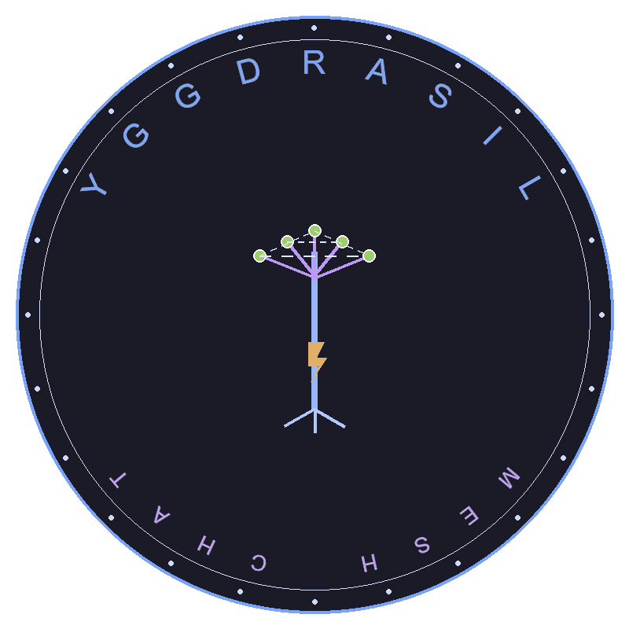
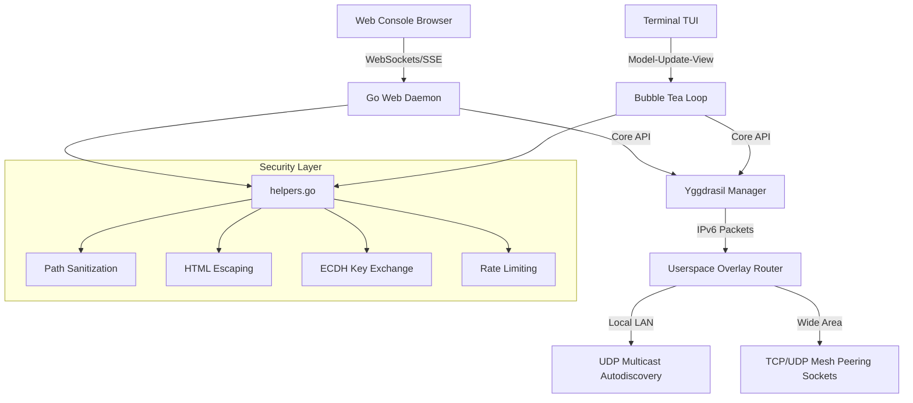

<p align="center">
  
</p>

<h1 align="center">⚡ YGGDRASIL MESH CHAT ⚡</h1>

<p align="center">
  <strong>A Zero-Dependency, Userspace, Decentralized P2P Messaging & File Exchange Client</strong>
</p>

<p align="center">
  
  
  
  
  
</p>

---

## 📖 Overview

**Yggdrasil Mesh Chat** is a next-generation, serverless, peer-to-peer chat client that operates in user-space directly on top of the **Yggdrasil IPv6 Overlay Network**. By utilizing a cryptographic routing tree, nodes peer with each other over TCP/UDP transport without any central servers, user directories, or third-party coordination. 

The application compiles into a **single, portable, zero-dependency executable** containing two interfaces: a stunning **Tokyo Night Web Console** (default) and a retro **Dracula/Nord Terminal TUI** powered by the Charmbracelet bubbletea stack.

---

## 🚀 Key Features

*   **🔒 End-to-End Encryption (E2EE)**: Curve25519 Diffie-Hellman Key Exchange (ECDH) initiated during contact discovery, deriving a persistent shared AES-GCM-256 key for message payloads.
*   **🌐 Subnet Autodiscovery**: Background UDP multicast beaconing (`224.0.0.50:9999`) automatically peers nearby local nodes on the same LAN with zero manual setup.
*   **🌍 Dual Interface Mode**: 
    *   **Web GUI (Default)**: A glassmorphic, responsive browser console with audio indicators, CSS screen shakes, and smooth micro-animations.
    *   **Terminal TUI (Alt)**: A keyboard-optimized Bubble Tea TUI with real-time responsive layout wrapping.
*   **📥 Asynchronous P2P File Transfers**: Splits files into 8KB chunks, sending them asynchronously over userspace overlay links. Completed PNG/JPG images display an **inline graphic preview** inside both Web and TUI histories.
*   **💬 Real-Time Feedback Loop**: Interactive read receipts (`✓✓` ticks), debounced active typing indicator notifications, and MSN-style `/shake` nudges.
*   **⏳ Delay-Tolerant Queueing**: Message queues are buffered locally on disk if contacts are offline, auto-flushing background ping handshakes once they announce back online.

---

## 🛡️ Security Features

*   **Path Traversal Protection**: All filenames are sanitized using `filepath.Base()` to prevent directory traversal attacks in file transfers.
*   **XSS Prevention**: All user input is HTML-escaped before rendering in the web UI, preventing cross-site scripting attacks.
*   **Rate Limiting**: Contact requests are rate-limited to 5 requests per minute per sender to prevent flooding attacks.
*   **Thread-Safe Configuration**: Configuration file access is protected by mutex locks for safe concurrent operations.
*   **Atomic File Writes**: History files use atomic write operations (temp file + rename) to prevent corruption during concurrent access.
*   **Input Validation**: Sender names are safely truncated to prevent index-out-of-range panics.

---

## 🏗️ Architecture



### File Structure

```
yggchat/
├── main.go              # Application entry point
├── config.go            # Configuration management with atomic writes
├── ygg.go               # Yggdrasil network manager
├── ygg_test.go          # Core functionality tests
├── discovery.go         # UDP multicast peer discovery
├── helpers.go           # Security & utility functions
├── helpers_test.go      # Comprehensive helper tests
├── web_server.go        # HTTP/SSE web server with CORS
├── tui.go               # Terminal UI (Bubble Tea)
├── ui_styles.go         # Theme definitions (5 themes)
├── image_render.go      # ANSI image preview renderer
├── web/
│   ├── index.html       # Web console frontend
│   ├── index.css        # Glassmorphic styling
│   └── index.js         # Client-side logic
├── go.mod
├── go.sum
└── README.md
```

---

## 💡 Practical Use Cases

1.  **Local Offline Emergency Operations**: In disaster zones or remote field operations with no internet access, run instances on laptops over a local Wi-Fi router. Nodes auto-discover each other via UDP multicast and allow secure coordination.
2.  **Private Local Network Teams**: Share files and message logs securely across dev subnets with zero config and zero dependency on corporate cloud messaging services.
3.  **Secure Hacker/Dev Terminals**: Chat securely with key-verified contacts directly from command-line workspaces inside terminal shells.

---

## ⚙️ Installation & Building

Since the application requires zero external runtime libraries, you only need Go (v1.20+) to compile the package:

```bash
# Clone the repository
git clone https://github.com/mesh/yggchat.git
cd yggchat

# Build the self-contained executable
go build -o yggchat.exe

# Run tests
go test -v ./...
```

---

## 🧪 Testing

The project includes comprehensive tests covering:

*   **Configuration Management**: Load/save validation, key encoding
*   **Chat Protocol**: Packet formatting, message serialization
*   **Cryptography**: ECDH key exchange, AES-GCM encryption/decryption
*   **Security Helpers**: Filename sanitization, HTML escaping, rate limiting
*   **Utility Functions**: Timestamp stripping, ANSI code removal, image detection

```bash
# Run all tests with verbose output
go test -v ./...

# Run specific test suite
go test -v -run TestSafeSenderName
go test -v -run TestDeriveSharedSecret
go test -v -run TestSanitizeFilename
```

---

## 🎮 How to Use

### 1. Launching the Web Console (Default)
Simply run the binary. It will boot the daemon, listen locally, and auto-open your default web browser:
```bash
./yggchat.exe
```
*   **Custom Port Override**: `./yggchat.exe --port 9090`
*   **Config Name Override**: `./yggchat.exe --config alice.json`

### 2. Launching the Terminal TUI
To run directly inside your shell console, append the `--tui` flag:
```bash
./yggchat.exe --tui
```

---

## ⌨️ Keyboard Shortcuts (TUI Mode)

| Shortcut | Description |
| :--- | :--- |
| **`Tab`** / **`Shift+Tab`** | Cycle panel focus (Sidebar ➔ Viewport ➔ Input field). |
| **`Ctrl+T`** | Cycle styles (Mocha ➔ Nord ➔ Gruvbox ➔ Dracula ➔ Tokyo Night). |
| **`Ctrl+Y`** | Copy your Node Public Key (or active contact's key) to Clipboard. |
| **`Ctrl+U`** | Clear entire input text bar instantly. |
| **`Ctrl+D`** | Toggle displaying message timestamps (`[15:04:05]`). |
| **`Ctrl+R`** | Force-retry dialing all configured peer socket links. |
| **`Ctrl+C`** | Safely shutdown node connections and exit application. |

---

## 💬 Slash Commands (Web & TUI)

Commands can be typed inside the main text bar. Press **`Tab`** for autocompletion.

*   `/help` - Outputs help documentation detailing all CLI slash commands.
*   `/nick <name>` - Changes your display username dynamically.
*   `/peer <tcp_uri>` - Manually initiates a connection to a remote socket (e.g. `tcp://1.2.3.4:9000`).
*   `/add <pubkey> <name>` - Broadcasts an E2EE key-exchange request to the contact.
*   `/ping` - Calculates round-trip latency to the active contact.
*   `/whois` - Displays contact's key info, link state, and E2EE verification status.
*   `/shake` - Sends a high-priority screen nudge, playing an audible beep on the peer node.
*   `/send <filepath>` - Initiates P2P file transmission with inline preview checks.
*   `/search <query>` - Searches local database history files for matching logs.
*   `/clear` - Wipes active chat console log caches locally.

---

## 📦 Dependencies

*   **Yggdrasil Core**: `github.com/yggdrasil-network/yggdrasil-go` - IPv6 overlay networking
*   **Ironwood**: `github.com/Arceliar/ironwood` - Cryptographic routing
*   **Bubble Tea**: `github.com/charmbracelet/bubbletea` - Terminal UI framework
*   **Lip Gloss**: `github.com/charmbracelet/lipgloss` - Terminal styling

---

## 🔧 Configuration

The application uses JSON configuration files:

```json
{
  "privateKey": "hex-encoded-ed25519-private-key",
  "ecdhPrivateKey": "hex-encoded-curve25519-ecdh-key",
  "peers": ["tcp://192.168.1.100:9000"],
  "listeners": ["tcp://0.0.0.0:9000"],
  "contacts": {
    "contact-public-key": {
      "publicKey": "hex-key",
      "nickname": "Alice",
      "sharedSecret": "hex-encoded-aes-key"
    }
  },
  "username": "MyUsername"
}
```

---

<p align="center">
  Made with ⚡ and Go by Advanced Agentic Coding.
</p>
