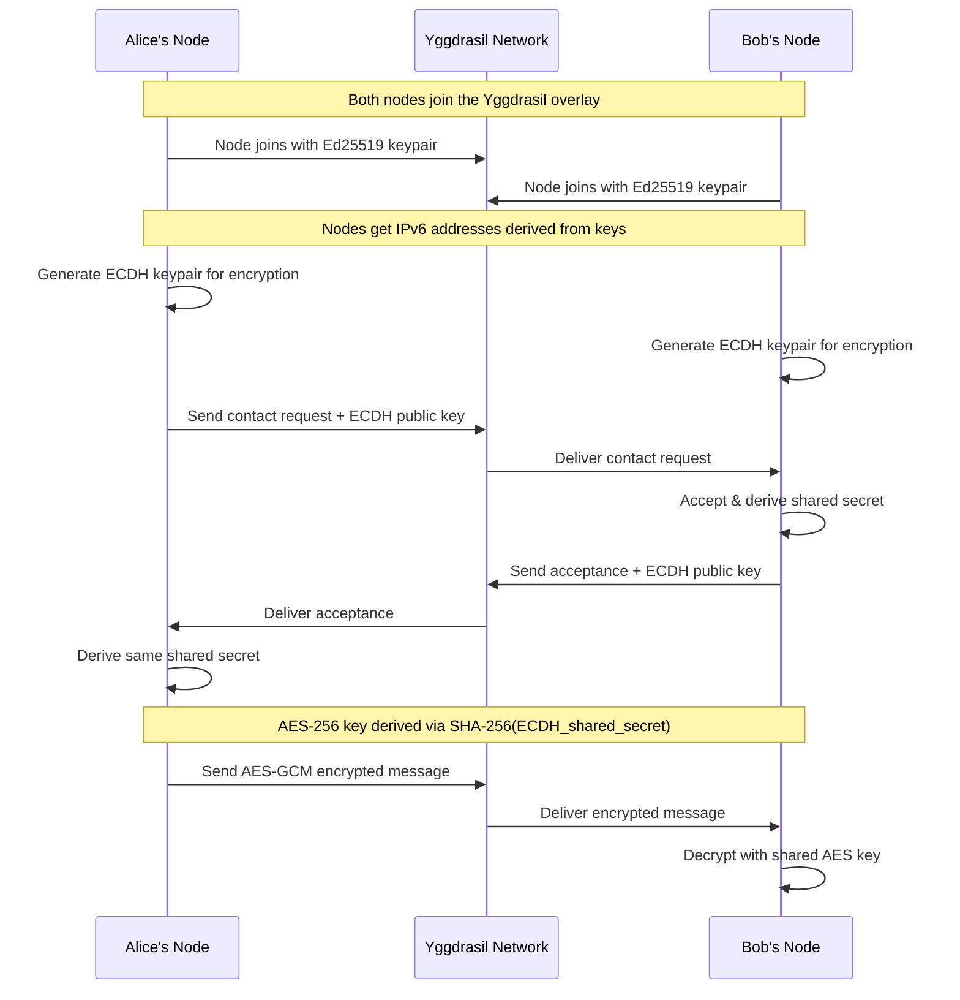
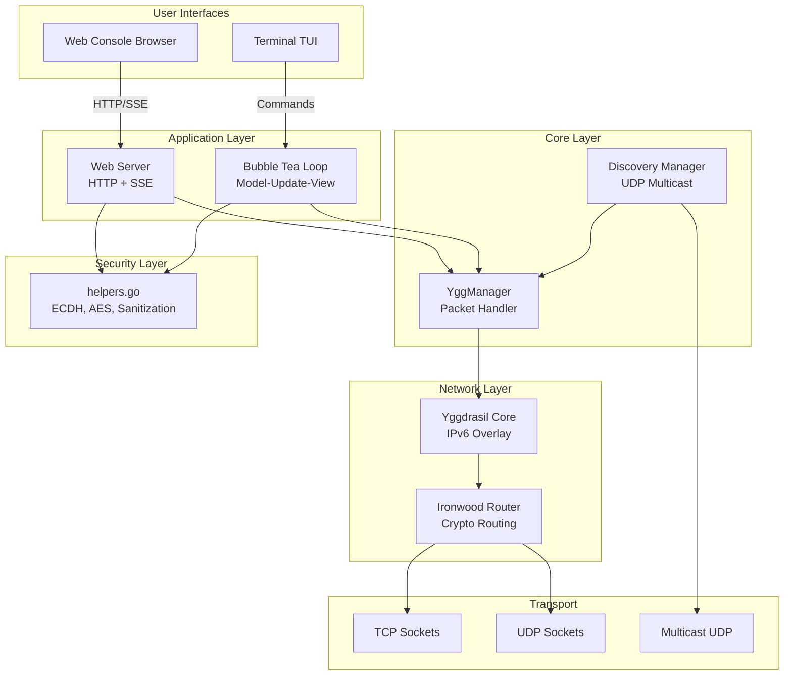

<p align="center">
  
</p>

<h1 align="center">⚡ YGGDRASIL MESH CHAT ⚡</h1>

<p align="center">
  <strong>A Zero-Dependency, Serverless, Decentralized P2P Encrypted Messaging & File Exchange Client</strong>
</p>

<p align="center">
  
  
  
  
  
  
</p>

---

## 📖 Table of Contents

- [Overview](#-overview)
- [Key Features](#-key-features)
- [Security Architecture](#-security-architecture)
- [System Architecture](#-system-architecture)
- [Installation & Building](#-installation--building)
- [Usage Guide](#-usage-guide)
- [Web Console](#-web-console)
- [Terminal TUI](#-terminal-tui)
- [Slash Commands Reference](#-slash-commands-reference)
- [Configuration](#-configuration)
- [File Transfers](#-file-transfers)
- [Encryption Deep Dive](#-encryption-deep-dive)
- [Network Discovery](#-network-discovery)
- [Testing](#-testing)
- [Troubleshooting](#-troubleshooting)
- [Practical Use Cases](#-practical-use-cases)
- [Dependencies](#-dependencies)
- [Contributing](#-contributing)
- [License](#-license)

---

## 📖 Overview

### What is Yggdrasil Mesh Chat?

**Yggdrasil Mesh Chat** is a next-generation, serverless, peer-to-peer encrypted messaging and file exchange client that operates entirely in user-space on top of the [Yggdrasil IPv6 Overlay Network](https://yggdrasil-network.github.io/). Unlike traditional messaging applications that rely on centralized servers, cloud infrastructure, and third-party services, Yggdrasil Mesh Chat enables direct, encrypted communication between nodes with **zero external servers**, **zero user accounts**, and **zero third-party coordination**.

### What is Yggdrasil?

[Yggdrasil](https://yggdrasil-network.github.io/) is an early-stage implementation of a fully encrypted, self-arranging IPv6 overlay network. It creates a decentralized mesh network where:

- **Every node gets a unique IPv6 address** — derived cryptographically from your public key
- **Routing is automatic** — nodes discover each other and build optimal paths
- **All traffic is encrypted** — using the Noise Protocol Framework
- **No central authority** — no DNS servers, no certificate authorities, no registrars
- **Works anywhere** — over LAN, WAN, internet, or any TCP/UDP connection

The name "Yggdrasil" comes from Norse mythology — the immense cosmic tree that connects the nine worlds. Similarly, the Yggdrasil network connects nodes across the world in a tree-like routing structure.

### How Does It Work?



### Why Was This Built?

Traditional messaging applications (Signal, WhatsApp, Telegram, Discord) all share common problems:

1. **Centralized Infrastructure**: They rely on servers that can go down, be hacked, or be compelled to hand over data
2. **Account Requirements**: Phone numbers, email addresses, or other personally identifiable information is required
3. **Metadata Collection**: Even with E2EE, servers know who talks to whom, when, and how often
4. **Internet Dependency**: They require internet connectivity to function
5. **Single Points of Failure**: If the company shuts down, the service disappears
6. **Trust Requirements**: You must trust the company to not backdoor the encryption

Yggdrasil Mesh Chat solves all of these problems by being:

- **Truly Decentralized**: No servers exist — nodes communicate directly
- **Identity-Free**: No accounts, phone numbers, or emails — just cryptographic keys
- **Metadata-Free**: No central entity sees your communication patterns
- **Network-Agnostic**: Works over LAN, WAN, mesh networks, or the internet
- **Resilient**: No single point of failure — the network survives as long as any two nodes exist
- **Trustless**: Cryptography, not corporate promises, protects your messages

### Architecture Philosophy

The application follows these core principles:

1. **Single Binary Distribution**: The entire application compiles into one executable with zero runtime dependencies
2. **User-Space Operation**: No root privileges, TUN/TAP devices, or kernel modules required
3. **Dual Interface Design**: Choose between a modern web UI or a traditional terminal interface
4. **Defense in Depth**: Multiple security layers protect against various attack vectors
5. **Graceful Degradation**: Features work even when some components fail
6. **Offline-First**: Messages queue locally and deliver when contacts come online

### Technical Specifications

| Specification | Value |
|---------------|-------|
| **Language** | Go 1.20+ |
| **Network Protocol** | Yggdrasil IPv6 Overlay (Noise Protocol Framework) |
| **Routing** | Ironwood cryptographic routing tree |
| **Transport** | TCP and UDP (auto-selected) |
| **Encryption (Network)** | ChaCha20-Poly1305 (Yggdrasil layer) |
| **Encryption (Messages)** | AES-256-GCM (application layer) |
| **Key Exchange** | Curve25519 ECDH |
| **Key Derivation** | SHA-256 |
| **Identity Keys** | Ed25519 |
| **Discovery** | UDP Multicast (224.0.0.50:9999) |
| **File Chunk Size** | 8 KB (8192 bytes) |
| **Default Port** | 9000 (Yggdrasil), 8080 (Web Console) |
| **Binary Size** | ~16 MB (self-contained) |
| **Runtime Dependencies** | None |

### What Makes This Different?

| Feature | Traditional Chat Apps | Yggdrasil Mesh Chat |
|---------|----------------------|---------------------|
| **Server Required** | ✅ Yes (centralized) | ❌ No (peer-to-peer) |
| **Account Registration** | ✅ Required | ❌ Not needed |
| **Internet Dependency** | ✅ Required | ❌ Works on LAN only |
| **Metadata Collection** | ✅ Yes | ❌ None |
| **Single Point of Failure** | ✅ Yes | ❌ Decentralized |
| **E2EE by Default** | ❌ Sometimes | ✅ Always |
| **File Sharing** | Via cloud servers | Direct P2P transfer |
| **Open Source** | ❌ Usually proprietary | ✅ Fully open source |
| **Self-Hostable** | ❌ Complex setup | ✅ Just run the binary |
| **Works Offline** | ❌ No | ✅ Yes (LAN mesh) |
| **Phone Number Required** | ✅ Usually | ❌ Never |
| **Metadata Visible to Provider** | ✅ Yes | ❌ No provider exists |

### Comparison with Similar Projects

| Project | Serverless | E2EE | File Transfer | Dual UI | Auto-Discovery |
|---------|------------|------|---------------|---------|----------------|
| **Yggdrasil Mesh Chat** | ✅ | ✅ | ✅ P2P | ✅ Web+TUI | ✅ UDP Multicast |
| Briar | ✅ | ✅ | ✅ | ❌ Android only | ✅ Tor/BT |
| Session | ❌ | ✅ | ✅ | ❌ | ❌ |
| Matrix/Element | ❌ | ✅ | ✅ | ✅ | ❌ |
| Jami | ✅ | ✅ | ✅ | ❌ | ✅ DHT |
| Tox | ✅ | ✅ | ✅ | ❌ | ✅ DHT |

### System Requirements

**Minimum:**
- Go 1.20+ (for building)
- Any modern OS: Windows, macOS, Linux, FreeBSD
- 10 MB disk space
- 50 MB RAM

**Recommended:**
- Go 1.21+ for optimal performance
- Local network connectivity for auto-discovery
- Port 9000 accessible for incoming connections

---

## 🚀 Key Features

### 🔒 End-to-End Encryption (E2EE)

All messages between contacts are encrypted using industry-standard cryptography:

- **Key Exchange**: Curve25519 Diffie-Hellman (ECDH) — the same protocol used by Signal, WhatsApp, and WireGuard
- **Message Encryption**: AES-256-GCM (Galois/Counter Mode) — provides both confidentiality and authenticity
- **Key Derivation**: SHA-256 hash of the shared secret ensures uniform key distribution
- **Perfect Forward Secrecy**: Each contact pair has a unique derived key
- **Visual Indicators**: 🔒 padlock icon shows E2EE status for each contact

### 🌐 Automatic Network Discovery

Nodes automatically discover and connect to nearby peers:

- **UDP Multicast Beaconing**: Broadcasts on `224.0.0.50:9999` every 5 seconds
- **LAN Auto-Peering**: Nodes on the same local network connect automatically
- **Self-Detection**: Prevents nodes from connecting to themselves
- **Zero Configuration**: No manual peer entry required for local network
- **Manual Peering**: Add remote peers via TCP URI (e.g., `tcp://1.2.3.4:9000`)

### 🌍 Dual Interface Mode

Choose your preferred interface:

**Web Console (Default)**
- Glassmorphic design with Tokyo Night color scheme
- Real-time updates via Server-Sent Events (SSE)
- CSS animations and screen shake effects
- Audio notifications via Web Audio API
- Responsive layout for all screen sizes
- Command autocomplete with Tab key

**Terminal TUI (Alternative)**
- 5 built-in themes: Catppuccin Mocha, Nord, Gruvbox, Dracula, Tokyo Night
- Keyboard-driven navigation (Tab, Arrow keys, shortcuts)
- Split-pane layout: Contacts sidebar | Chat viewport | Input field
- Inline image previews using ANSI half-block characters
- Typing indicators and read receipts
- Message history scrolling

### 📥 Asynchronous P2P File Transfers

Send files directly between nodes without any intermediary:

- **Chunked Transfer**: Files split into 8KB chunks for reliable delivery
- **Asynchronous Sending**: Non-blocking file transfers with progress tracking
- **Progress Indicators**: Real-time percentage display during transfer
- **Image Previews**: PNG/JPG files show inline previews after completion
- **Safe Filenames**: Path traversal protection prevents directory escape
- **Auto-Resume**: Failed chunks can be retried

### 💬 Real-Time Messaging Features

- **Read Receipts**: Single check (✓) when sent, double check (✓✓) when read
- **Typing Indicators**: See when your contact is typing (debounced at 2 seconds)
- **Nudge/Shake**: Send attention-grabbing screen vibrations with audio alerts
- **Offline Queueing**: Messages buffered locally when contact is offline
- **Auto-Flush**: Queued messages automatically sent when contact comes online
- **Message Search**: Full-text search through chat history

### ⌨️ Keyboard Shortcuts (TUI)

| Shortcut | Action |
|----------|--------|
| `Tab` / `Shift+Tab` | Cycle focus: Sidebar → Viewport → Input |
| `Ctrl+T` | Cycle themes (Mocha → Nord → Gruvbox → Dracula → Tokyo Night) |
| `Ctrl+Y` | Copy public key to clipboard |
| `Ctrl+U` | Clear input field |
| `Ctrl+D` | Toggle timestamp display |
| `Ctrl+R` | Force retry all peer connections |
| `Ctrl+N` | Add new contact |
| `Ctrl+A` | Add new peer |
| `Ctrl+P` | Switch to Peers view |
| `Ctrl+H` | Switch to Chat view |
| `Ctrl+S` | Switch to Settings view |
| `Ctrl+C` | Quit application |
| `↑` / `Down` | Navigate contacts / Scroll chat / Input history |
| `Enter` | Send message / Select contact |
| `Delete` / `Backspace` | Remove selected peer |

---

## 🛡️ Security Architecture

### Threat Model

Yggdrasil Mesh Chat is designed to protect against:

| Threat | Protection |
|--------|------------|
| **Eavesdropping** | E2EE with AES-256-GCM |
| **Man-in-the-Middle** | Curve25519 key exchange with contact verification |
| **Message Forgery** | GCM authentication tags |
| **Replay Attacks** | Timestamp-based nonce with random component |
| **Path Traversal** | Filename sanitization via `filepath.Base()` |
| **XSS Attacks** | HTML escaping of all user input |
| **Flooding/Spam** | Rate limiting on contact requests (5/minute) |
| **Data Corruption** | Atomic file writes (temp + rename) |
| **Race Conditions** | Mutex-protected configuration access |

### Cryptographic Details

```
Key Exchange Flow:
  Alice                          Bob
    |                              |
    |-- Contact Request + PubA -->|
    |                              |
    |<-- Contact Accept + PubB ---|
    |                              |
    SharedSecret = ECDH(PrivA, PubB) = ECDH(PrivB, PubA)
    AESKey = SHA-256(SharedSecret)
    |                              |
    |-- AES-GCM(Key, Nonce, Msg) ->|
    |<- AES-GCM(Key, Nonce, Msg) --|
```

### Security Best Practices

1. **Verify Contact Keys**: Always verify your contact's public key through a separate channel
2. **Use Strong Usernames**: Choose unique usernames to avoid impersonation
3. **Keep Software Updated**: Regularly pull latest changes for security patches
4. **Firewall Configuration**: Block unnecessary ports on your overlay IPv6 address
5. **Separate Configs**: Use different config files for different identities

---

## 🏗️ System Architecture



### File Structure

```
yggchat/
├── main.go                 # Application entry point & CLI flags
├── config.go               # Configuration management with atomic writes
├── ygg.go                  # Yggdrasil network manager & packet handling
├── ygg_test.go             # Core functionality tests
├── discovery.go            # UDP multicast peer discovery
├── helpers.go              # Security functions & shared utilities
├── helpers_test.go         # Comprehensive helper tests
├── web_server.go           # HTTP server, SSE, API endpoints
├── tui.go                  # Terminal UI (Bubble Tea framework)
├── ui_styles.go            # Theme definitions (5 color schemes)
├── image_render.go         # ANSI image preview renderer
├── web/
│   ├── index.html          # Web console HTML structure
│   ├── index.css           # Glassmorphic CSS styling
│   └── index.js            # Client-side JavaScript logic
├── go.mod                  # Go module dependencies
├── go.sum                  # Dependency checksums
├── .gitignore              # Git ignore rules
├── README.md               # This file
└── logo.png                # Application logo
```

### Data Flow

```
1. User types message in Web/TUI
2. Message sent to WebServer/TUI handler
3. Handler checks if contact has shared secret (E2EE)
4. If encrypted: AES-GCM encrypt with derived key
5. Payload serialized as JSON with "YGGC" magic header
6. YggManager sends packet via Yggdrasil overlay
7. Recipient's YggManager receives packet
8. Payload deserialized and decrypted if needed
9. Message displayed in recipient's UI
```

---

## ⚙️ Installation & Building

### Prerequisites

- **Go 1.20+** (download from [golang.org](https://golang.org/dl/))
- **Git** (for cloning the repository)

### Build from Source

```bash
# Clone the repository
git clone https://github.com/amafjarkasi/yggchat.git
cd yggchat

# Build the executable
go build -o yggchat.exe

# Or build for Linux
GOOS=linux GOARCH=amd64 go build -o yggchat

# Or build for macOS
GOOS=darwin GOARCH=arm64 go build -o yggchat
```

### Run Tests

```bash
# Run all tests
go test -v ./...

# Run specific test
go test -v -run TestECDHKeyExchange

# Run with coverage
go test -cover ./...
```

### Quick Start

```bash
# Launch Web Console (default)
./yggchat.exe

# Launch Terminal TUI
./yggchat.exe --tui

# Custom port
./yggchat.exe --port 9090

# Custom config file
./yggchat.exe --config alice.json

# Combine flags
./yggchat.exe --tui --config bob.json
```

---

## 🎮 Usage Guide

### First Launch

1. Run `./yggchat.exe` (Web Console) or `./yggchat.exe --tui` (Terminal)
2. A new config file (`yggchat.json`) is generated with:
   - Ed25519 private key for Yggdrasil identity
   - Curve25519 ECDH key for encryption
   - Default listener on `tcp://0.0.0.0:9000`
3. Your node joins the Yggdrasil mesh network
4. UDP multicast discovers nearby peers automatically

### Adding a Contact

1. Get your contact's Yggdrasil public key (they can copy it with `Ctrl+Y`)
2. Use `/add <public_key> <nickname>` or click the **+** button
3. A contact request is sent with your ECDH public key
4. When they accept, E2EE is automatically established
5. Look for the 🔒 padlock indicator

### Sending Messages

1. Select a contact from the sidebar
2. Type your message in the input field
3. Press `Enter` or click **SEND**
4. Messages are encrypted if E2EE is established
5. Read receipts show ✓ (sent) and ✓✓ (read)

### Sending Files

1. Select a contact
2. Use `/send <filepath>` (e.g., `/send ~/photo.jpg`)
3. File is split into 8KB chunks and sent asynchronously
4. Progress is shown in real-time
5. Image files (PNG/JPG) display inline previews

---

## 🖥️ Web Console

### Features

- **Glassmorphic UI**: Translucent panels with blur effects
- **Real-Time Updates**: Server-Sent Events (SSE) for instant messaging
- **Audio Notifications**: Web Audio API generates beep sounds
- **Screen Shake**: CSS animations for nudge/shake messages
- **Command Autocomplete**: Press Tab to cycle through commands
- **Responsive Design**: Works on desktop and mobile browsers

### API Endpoints

| Endpoint | Method | Description |
|----------|--------|-------------|
| `/` | GET | Serve web console frontend |
| `/events` | GET | SSE event stream |
| `/api/state` | GET | Get current state (contacts, history, peers) |
| `/api/send` | POST | Send message or command |

### SSE Event Types

| Event | Description |
|-------|-------------|
| `incoming_msg` | New message received |
| `typing` | Contact is typing |
| `read` | Read receipt received |
| `shake` | Nudge/shake received |
| `contact_req` | Contact request received |
| `peers` | Peer status update |

---

## 💻 Terminal TUI

### Views

**Chat View** (`Ctrl+H`)
- Contact sidebar with unread indicators
- Message viewport with scroll support
- Input field with command history (↑/↓ arrows)
- Typing indicator display

**Peers View** (`Ctrl+P`)
- List of connected peers
- Online/offline status
- Connection direction (inbound/outbound)
- Latency and traffic statistics
- Remove peers with Delete key

**Settings View** (`Ctrl+S`)
- Username display
- IPv6 overlay address
- Public key (hex)
- Listener configuration

### Themes

| Theme | Description |
|-------|-------------|
| Catppuccin Mocha | Default dark theme with pastel accents |
| Nord | Arctic blue color scheme |
| Gruvbox | Retro warm color scheme |
| Dracula | Purple-accented dark theme |
| Tokyo Night | Deep blue night theme |

---

## 💬 Slash Commands Reference

### General Commands

| Command | Description | Example |
|---------|-------------|---------|
| `/help` | Show all available commands | `/help` |
| `/nick <name>` | Change your display name | `/nick Alice` |
| `/clear` | Clear chat history for active contact | `/clear` |
| `/whois` | Display contact information and E2EE status | `/whois` |

### Network Commands

| Command | Description | Example |
|---------|-------------|---------|
| `/peer <uri>` | Connect to a remote peer | `/peer tcp://1.2.3.4:9000` |
| `/ping` | Measure latency to active contact | `/ping` |

### Contact Commands

| Command | Description | Example |
|---------|-------------|---------|
| `/add <key> <name>` | Send contact request | `/add abc123... Bob` |
| `/shake` | Send nudge/shake to active contact | `/shake` |
| `/shout <msg>` | Broadcast message to all contacts | `/shout Hello everyone!` |

### File Commands

| Command | Description | Example |
|---------|-------------|---------|
| `/send <path>` | Send file to active contact | `/send ~/document.pdf` |
| `/search <query>` | Search chat history | `/search important` |

---

## 🔧 Configuration

### Config File Location

Default: `yggchat.json` in the current directory

Override with: `--config <filename>`

### Config Structure

```json
{
  "privateKey": "hex-encoded-ed25519-private-key",
  "ecdhPrivateKey": "hex-encoded-curve25519-ecdh-key",
  "peers": [
    "tcp://192.168.1.100:9000",
    "tcp://10.0.0.5:9000"
  ],
  "listeners": [
    "tcp://0.0.0.0:9000"
  ],
  "contacts": {
    "contact-public-key-hex": {
      "publicKey": "contact-public-key-hex",
      "nickname": "Alice",
      "sharedSecret": "hex-encoded-aes-256-key"
    }
  },
  "username": "MyUsername"
}
```

### Config Fields

| Field | Type | Description |
|-------|------|-------------|
| `privateKey` | string | Ed25519 private key for Yggdrasil identity (auto-generated) |
| `ecdhPrivateKey` | string | Curve25519 private key for E2EE (auto-generated) |
| `peers` | string[] | List of peer URIs to connect to |
| `listeners` | string[] | List of addresses to listen on |
| `contacts` | object | Map of contact public keys to contact info |
| `username` | string | Your display name |

### Related Files

| File | Description |
|------|-------------|
| `yggchat.json` | Main configuration |
| `yggchat_history.json` | Chat message history |
| `yggchat_pending.json` | Queued offline messages |
| `downloads/` | Received files |

---

## 📥 File Transfers

### How It Works

1. Sender reads file from disk
2. File is split into 8KB chunks
3. Each chunk sent as a `file_chunk` payload
4. Receiver appends chunks to file in `./downloads/`
5. Progress updates displayed in chat
6. Image files render inline previews on completion

### Supported File Types

| Type | Inline Preview |
|------|---------------|
| PNG | ✅ Yes |
| JPG/JPEG | ✅ Yes |
| Other | ❌ No (saved to downloads) |

### Transfer Limits

- Chunk size: 8KB (8192 bytes)
- Pacing: 50ms delay between chunks
- Max filename: Sanitized via `filepath.Base()`
- Storage: `./downloads/` directory

---

## 🔐 Encryption Deep Dive

### Key Exchange Protocol

1. **Alice** generates ephemeral Curve25519 keypair
2. **Alice** sends `contact_req` with her public key to **Bob**
3. **Bob** generates ephemeral Curve25519 keypair
4. **Bob** computes `SharedSecret = ECDH(PrivB, PubA)`
5. **Bob** derives `AESKey = SHA-256(SharedSecret)`
6. **Bob** sends `contact_acc` with his public key to **Alice**
7. **Alice** computes same `SharedSecret = ECDH(PrivA, PubB)`
8. Both now share the same AES-256 key

### Message Encryption

```go
// Encryption
nonce = random(12 bytes)
ciphertext = AES-GCM-Seal(key, nonce, plaintext, aad)
payload = {text: hex(ciphertext), nonce: hex(nonce), is_encrypted: true}

// Decryption
plaintext = AES-GCM-Open(key, nonce, ciphertext, aad)
```

### Security Properties

- **Confidentiality**: AES-256-GCM encryption
- **Authenticity**: GCM authentication tags
- **Integrity**: Tampered messages fail decryption
- **Forward Secrecy**: Per-contact key isolation
- **No Key Escrow**: Keys never leave your device

---

## 🌐 Network Discovery

### Multicast Discovery Protocol

```
Every 5 seconds:
1. Get local IPv4 addresses
2. For each address, broadcast: "tcp://<ip>:<port>"
3. Listen for broadcasts from other nodes
4. If received URI is not self, add as peer
```

### Manual Peering

For connections beyond local network:

```bash
# From Node A
/peer tcp://<node-b-ip>:9000

# Or configure in yggchat.json
{
  "peers": ["tcp://203.0.113.50:9000"]
}
```

### NAT Traversal

Yggdrasil supports peering through:
- Direct TCP connections
- UDP connections
- SOCKS5 proxies
- Tor hidden services

---

## 🧪 Testing

### Running Tests

```bash
# All tests
go test -v ./...

# Specific test suite
go test -v -run TestSafeSenderName
go test -v -run TestDeriveSharedSecret
go test -v -run TestSanitizeFilename
go test -v -run TestECDHKeyExchange
go test -v -run TestIsContactRequestAllowed

# With coverage
go test -cover ./...
```

### Test Coverage

| Module | Tests |
|--------|-------|
| Configuration | Load/save, key encoding, contacts |
| Chat Protocol | Packet formatting, serialization |
| Cryptography | ECDH exchange, AES-GCM encrypt/decrypt |
| Security Helpers | Filename sanitization, HTML escaping, rate limiting |
| Utilities | Timestamp stripping, ANSI removal, image detection |
| History | Atomic writes, load/save integrity |

---

## ❓ Troubleshooting

### Common Issues

**"Failed to start Yggdrasil core"**
- Port 9000 may be in use
- Try: `./yggchat.exe --config new.json` for fresh config

**No peers discovered**
- Ensure UDP multicast is not blocked by firewall
- Check if nodes are on same subnet
- Try manual peering: `/peer tcp://<ip>:9000`

**Messages not delivering**
- Check if contact is online (peer status)
- Messages queue automatically for offline contacts
- Use `/ping` to test connectivity

**E2EE not working**
- Ensure contact request was accepted
- Check for 🔒 padlock indicator
- Verify with `/whois` command

**Web Console not loading**
- Check if port 8080 is available
- Try different port: `--port 9090`
- Check browser console for errors

**File transfer fails**
- Ensure `./downloads/` directory exists
- Check file permissions
- Verify contact is online

---

## 💡 Practical Use Cases

### 1. Disaster Relief Operations

In areas without internet infrastructure:
- Connect laptops via local Wi-Fi router
- Nodes auto-discover via UDP multicast
- Coordinate rescue operations securely
- Share maps and documents P2P

### 2. Development Team Communication

On corporate or lab networks:
- Zero dependency on external services
- No IT approval needed for installation
- Share code snippets and files directly
- Encrypted by default for compliance

### 3. Privacy-Focused Messaging

For journalists, activists, or privacy advocates:
- No accounts or phone numbers required
- No metadata collection
- End-to-end encrypted
- Works over Tor or VPN

### 4. Offline Events & Conferences

At conferences or events with poor connectivity:
- Set up local mesh network
- Attendees can chat without internet
- Share presentations and documents
- Works in remote venues

### 5. Gaming & LAN Parties

For local multiplayer coordination:
- Zero-latency local messaging
- Share game files and mods
- No internet required
- Fun retro TUI interface

---

## 📦 Dependencies

### Core Dependencies

| Package | Purpose |
|---------|---------|
| `yggdrasil-network/yggdrasil-go` | IPv6 overlay networking |
| `Arceliar/ironwood` | Cryptographic routing |
| `Arceliar/phony` | Actor model concurrency |

### UI Dependencies

| Package | Purpose |
|---------|---------|
| `charmbracelet/bubbletea` | Terminal UI framework |
| `charmbracelet/bubbles` | TUI components (input, viewport) |
| `charmbracelet/lipgloss` | Terminal styling |

### Other Dependencies

| Package | Purpose |
|---------|---------|
| `gologme/log` | Logging |
| `coder/websocket` | WebSocket support |
| `quic-go/quic-go` | QUIC protocol |

---

## 🤝 Contributing

### Development Setup

```bash
# Clone repository
git clone https://github.com/amafjarkasi/yggchat.git
cd yggchat

# Install dependencies
go mod tidy

# Run tests
go test -v ./...

# Build
go build -o yggchat.exe
```

### Code Structure

- `main.go` — Entry point and CLI parsing
- `config.go` — Configuration management
- `ygg.go` — Core Yggdrasil integration
- `helpers.go` — Shared security and utility functions
- `web_server.go` — HTTP/SSE web server
- `tui.go` — Terminal UI implementation
- `discovery.go` — Network discovery

### Pull Request Process

1. Fork the repository
2. Create a feature branch
3. Add tests for new functionality
4. Ensure all tests pass
5. Submit pull request with description

---

## 📄 License

MIT License - See [LICENSE](LICENSE) file for details

---

<p align="center">
  <strong>Made with ⚡ and Go</strong>
</p>

<p align="center">
  <a href="https://github.com/amafjarkasi/yggchat">GitHub</a> •
  <a href="https://github.com/amafjarkasi/yggchat/issues">Issues</a> •
  <a href="https://github.com/amafjarkasi/yggchat/releases">Releases</a>
</p>
